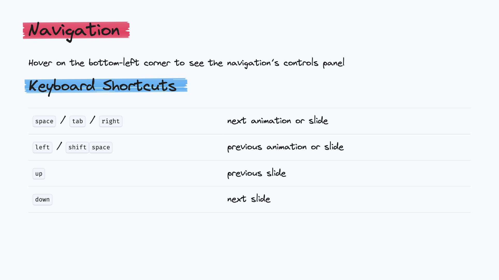
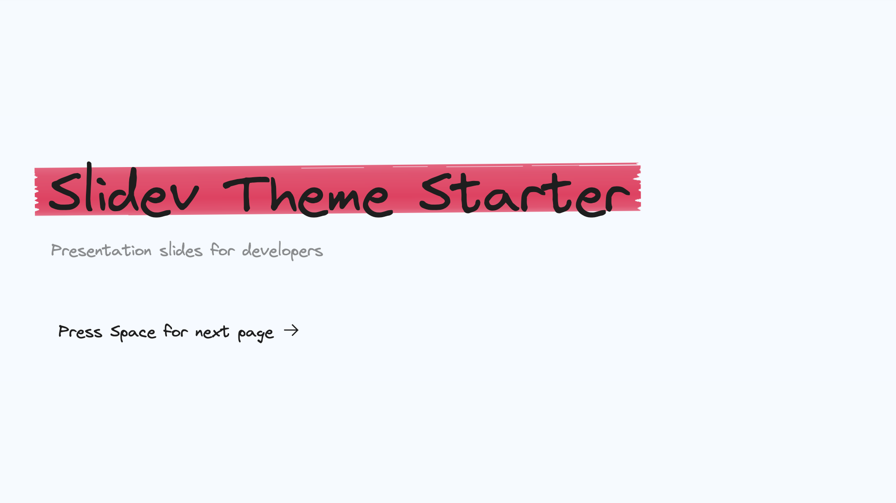
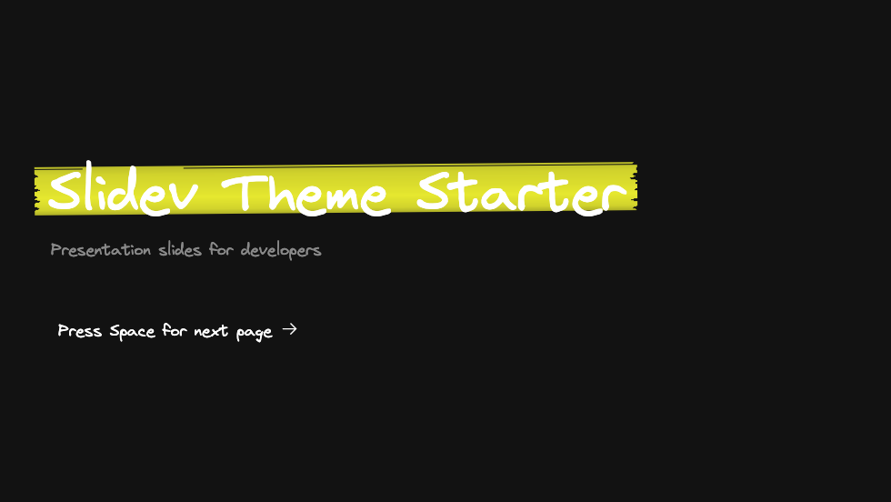

# slidev-theme-excali-slide

A [Excalidraw](https://excalidraw.com/)-like theme for [Slidev](https://github.com/slidevjs/slidev).

Theme works in dark mode too. In this case, the highlight color have the opacity set to 0.9.

Theme comes with animated heading highlights. You can customize their colors by setting up following properties:

<pre><code>---
themeConfig:
  primary-highlight: '#F3EFF5'
  secondary-highlight: '#161C2C'
  marker-animation: disabled; // optional
---</code></pre>

## Install

Add the following frontmatter to your `slides.md`. Start Slidev then it will prompt you to install the theme automatically.

<pre><code>---
theme: <b>excali-slide</b>
---</code></pre>

Learn more about [how to use a theme](https://sli.dev/guide/theme-addon#use-theme).

## Contributing

- `npm install`
- `npm run dev` to start theme preview of `example.md`
- Edit the `example.md` and style to see the changes
- `npm run export` to generate the preview PDF
- `npm run screenshot` to generate the preview PNG
